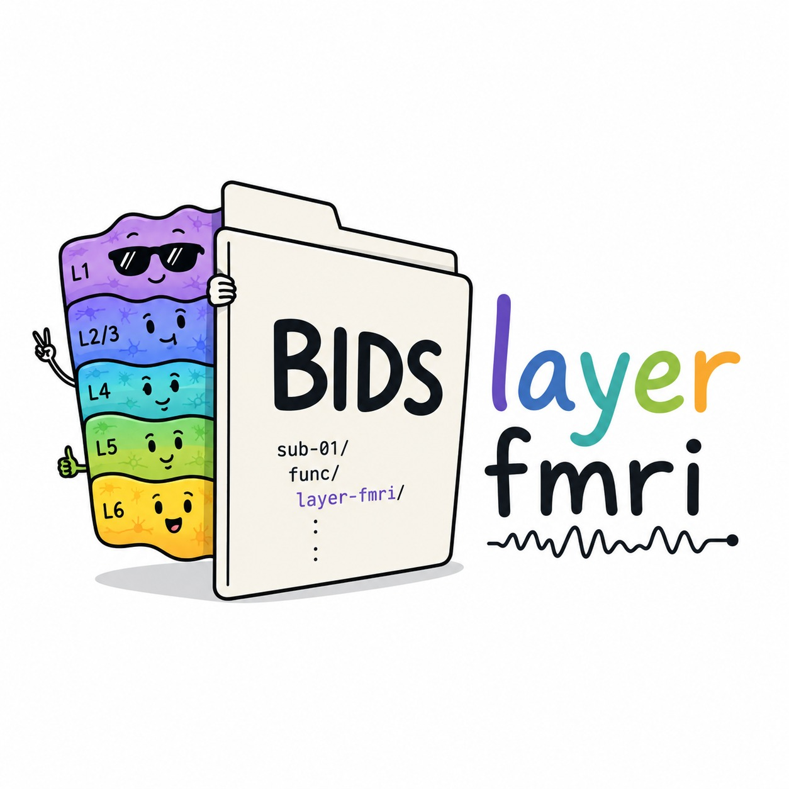

# BIDS_layerfMRI
A project from OHBM BrainHack 2026  
Based on discussions with the community during the OHBM BrainHack (2026), we propose the following structure as “initial prototype” with the minimum requirement for organizing layer-fMRI datasets. Files that required new BIDSfycation are highligted in *italic*.   
Prototype dataset: https://zenodo.org/records/20679524

Dataset_layer-fMRI_example  
Dataset_description.json  
├── sub-02  
│  ├── sess-02  
│   │   ├── func  
│   │   └──  sub-02_sess-04_task-movie_run-01_bold.nii.gz  
│   │   ├── anat  
│   │   └──  sub-02_sess-01_run-01_T1w.nii.gz  
├── derivative  
│  ├── anat  
│  └──  sub-02_desc-preproc_T1w.nii.gz  
│  └──  sub-02_seg-braintissues_dseg.nii.gz  
│  └──  braintissues_dseg.tsv  
│  └──  sub-02_space-NATIVE_atlas-Glasser.nii.gz  
│  └──  atlas-Glasser_description.json  
│  └──  *sub-02_seg-depth_method-equivol.nii.gz*  
│  └──  *depth_description.json*  
│  └──  *sub-02_seg-layer_method-equivol.nii.gz*  
│  └──  *layer_dseg.tsv*  
│  └──  sub-02_roi-V1_dseg.nii.gz  
│  └──  roi_dseg.tsv  
│  ├── func  
│  └──  sub-02_sess-04_task-movie_run-01_space-NATIVE_desc-prepro_bold.nii.gz  
│  └── sub-02_sess-04_task-movie_run-01_space-NATIVE_stat-mean_bold.nii.gz  
│  └── sub-02_sess-04_task-movie_run-01_space-NATIVE_stat-tsnr_bold.nii.gz  

